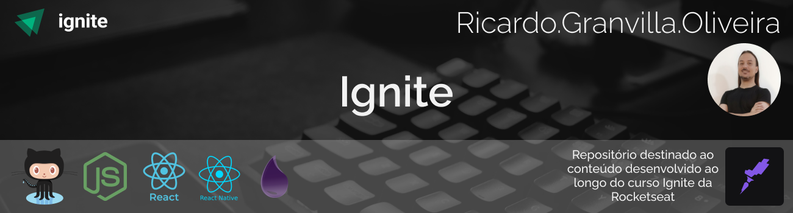

<h3 align="center">
🚧 Repositório do Curso Ignite Rocketseat 🚀 em construção... 🚧

&nbsp;

</h3>

# Ignite

&nbsp;

## 💻 **Sobre o curso**

 

O Ignite é um programa de aceleração para devs, focado em preparar profissionais completos(as) para o mercado, treinando skills técnicas e comportamentais de forma intensiva e prática. O Ignite é dividido em trilhas de conhecimento não-dependentes onde nos aprofundamos em uma tecnologia específica.

Em resumo, o objetivo do Ignite é desenvolver habilidades que vão acelerar sua carreira através de uma metodologia de aprendizado eficiente, um currículo alinhado às necessidades do mercado e as atitudes que vão te ajudar a se destacar como profissional.
 
 

&nbsp;

.

&nbsp;

## 📖 **Trilhas**

- [ReactJs](#-reactjs)
- [React Native](#-react-native)
- [Node Js](#-nodejs)
- [Elixir](#-elixir)
   

&nbsp;

## 🛠 Tecnologias

 

- Linguagens e Supersets:

  - [Javascript](https://developer.mozilla.org/pt-BR/docs/Web/JavaScript)
  - [TypeScript](https://www.typescriptlang.org/)
     
     

- Runtimes:

  - [Node Js](https://nodejs.org/pt-br/)
     
     

- Frameworks:

  - [React Js](https://pt-br.reactjs.org/)
  - [React Native](https://reactnative.dev/)
  - [Next.js](https://nextjs.org/)
     
     

- Outras Ferramentas:

  - [Sass](https://sass-lang.com/)
  - [Date-fns](https://date-fns.org/v2.21.1/docs/format)
       
     

- Rendering Patterns:
  - Single Page Aplication (SPA)
  - Server-side Rendering (SSR)
  - Static Site Generations (SSG)
     
     

## 🖥 ReactJs

### Projeto 01

...

🚧 Trilha React Js 🚀 em construção... 🚧

&nbsp;

## Desenvolvedor

&nbsp;

<a href="https://github.com/rgranvilla">Ricardo Granvilla 🚀</a>

&nbsp;

