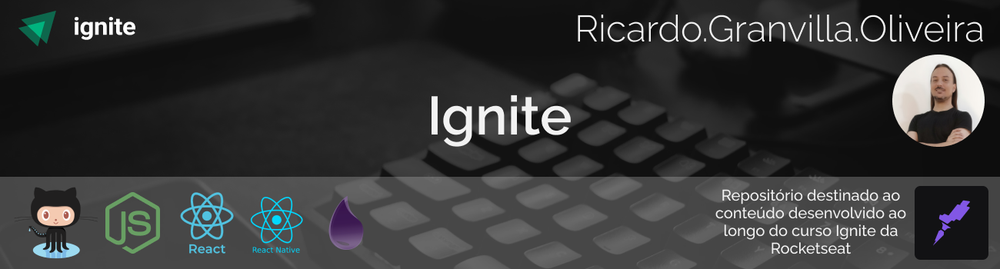
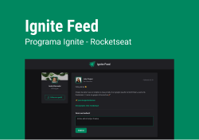
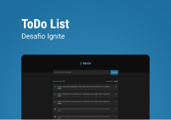
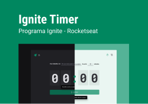
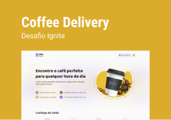

<h3 align="center">
🚧 Repositório do Curso Ignite Rocketseat 🚀 em construção... 🚧

&nbsp;

</h3>

# Ignite

&nbsp;

## 💻 **Sobre o curso**

 

O Ignite é um programa de aceleração para devs, focado em preparar profissionais completos(as) para o mercado, treinando skills técnicas e comportamentais de forma intensiva e prática. O Ignite é dividido em trilhas de conhecimento não-dependentes onde nos aprofundamos em uma tecnologia específica.

Em resumo, o objetivo do Ignite é desenvolver habilidades que vão acelerar sua carreira através de uma metodologia de aprendizado eficiente, um currículo alinhado às necessidades do mercado e as atitudes que vão te ajudar a se destacar como profissional.
 
 

&nbsp;

.

&nbsp;

## 📖 **Trilhas**

- [ReactJs](#-reactjs)
- [React Native](#-react-native)
- [Node Js](#-nodejs)
- [Elixir](#-elixir)
   

&nbsp;

## 🛠 Tecnologias

&nbsp;

- Linguagens e Supersets:

  - [Javascript](https://developer.mozilla.org/pt-BR/docs/Web/JavaScript)
  - [TypeScript](https://www.typescriptlang.org/)
  
&nbsp;

- Runtimes:

  - [Node Js](https://nodejs.org/pt-br/)
  
&nbsp;

- Frameworks:

  - [React Js](https://pt-br.reactjs.org/)
  - [React Native](https://reactnative.dev/)
  - [Next.js](https://nextjs.org/)
  
&nbsp;

- Outras Ferramentas:

  - [Axios](https://axios-http.com/)
  - [Commitizen](https://commitizen-tools.github.io/commitizen/)
  - [Date-fns](https://date-fns.org/)
  - [EsLint](https://eslint.org/)
  - [Husky](https://typicode.github.io/husky/#/)
  - [Immer](https://immerjs.github.io/immer/)
  - [Lint-Staged](https://github.com/okonet/lint-staged#readme)
  - [Phosphor-React](https://phosphoricons.com/)
  - [Polished](https://polished.js.org/)
  - [Prettier](https://prettier.io/)
  - [React-Hook-Form](https://react-hook-form.com/)
  - [React-IMask](https://imask.js.org/)
  - [React-Router-Dom](https://github.com/remix-run/react-router/blob/main/docs/start/tutorial.md)
  - [Styled-Components](https://styled-components.com/)
  - [Turborepo](https://turborepo.org/)
  - [Uuid](https://github.com/uuidjs/uuid#readme)
  - [ViteJs](https://vitejs.dev/)
  - [Yup](https://github.com/jquense/yup#readme)
  - [Zod](https://zod.dev/)
    
&nbsp;

- Rendering Patterns:
  - Single Page Aplication (SPA)
  - Server-side Rendering (SSR)
  - Static Site Generations (SSG)
  
&nbsp;

## 🖥 ReactJs

### Projeto 01 - Iniciando com React

Nesse módulo, criaremos uma aplicação React utilizando o Vite e aprenderemos sobre os conceitos mais importantes do React, entre eles estão componentização, propriedades, estados, imutabilidade e hooks, além de aplicar o Typescript no nosso projeto para adicionar tipagem estática à aplicação.

  
&nbsp;

Packages:

  
&nbsp;

courses/reactjs/v2/

- [01-ignite-feed](https://github.com/rgranvilla/Ignite/tree/master/courses/reactjs/v2/01-ignite-feed)
- [01-ignite-feed-ts](https://github.com/rgranvilla/Ignite/tree/master/courses/reactjs/v2/01-ignite-feed-ts)

challenges/reactjs/v2/

- [01-todo-list](https://github.com/rgranvilla/Ignite/tree/master/challenges/reactjs/v2/01-todo-list)

  
&nbsp;

### Projeto 02 - Criando SPAs com ReactJS

Nesse módulo iremos construir uma aplicação completa com roteamento e diversos conceitos importantes do ecossistema React como ContextAPI, useReducer, immer e muito mais.

  
&nbsp;

Packages:

  
&nbsp;

courses/reactjs/v2/

- [02-ignite-timer](https://github.com/rgranvilla/Ignite/tree/master/courses/reactjs/v2/02-ignite-timer)

challenges/reactjs/v2

- [02-coffee-delivery](https://github.com/rgranvilla/Ignite/tree/master/challenges/reactjs/v2/02-coffee-delivery)

🚧 Trilha React Js 🚀 em construção... 🚧

&nbsp;

### Projeto 03 - Consumo de API e performance no ReactJS

Nesse módulo construiremos uma aplicação front-end web completa, conectando a uma API e veremos como performar aplicações com o React entendendo como funcionam os algoritmos internos da biblioteca e todo o fluxo de renderização de componentes.

  
&nbsp;

Packages:

  
&nbsp;

courses/reactjs/v2/

- [03-ignite-dt-money](https://github.com/rgranvilla/Ignite/tree/master/courses/reactjs/v2/03-ignite-dt-money#readme)

🚧 Trilha React Js 🚀 em construção... 🚧

&nbsp;

## Desenvolvedor

&nbsp;

<a href="https://github.com/rgranvilla">Ricardo Granvilla 🚀</a>

&nbsp;

