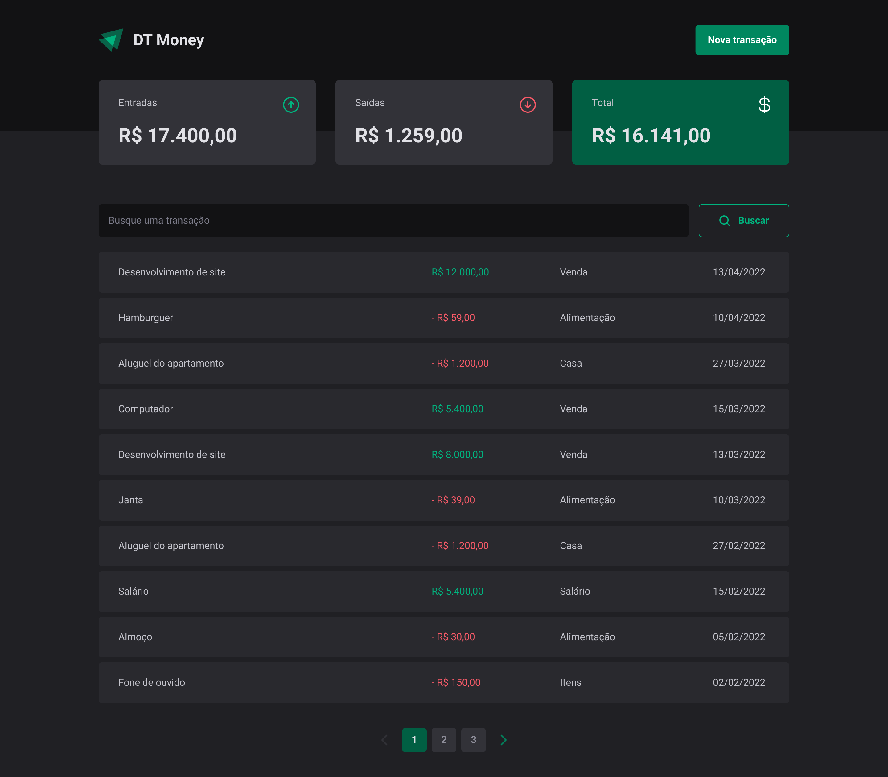

# Projeto 03 - Consumo de API e performance no ReactJS

 

<table border="0">
 <tr>
    <td style="min-width: 250px">
      
    </td>
    <td style="max-width: 600px">
    

    Nesse módulo construiremos uma aplicação front-end web completa, conectando a uma API e veremos como performar aplicações com o React entendendo como funcionam os algoritmos internos da biblioteca e todo o fluxo de renderização de componentes.
    

    </td>

 </tr>
</table>

 
 s

## 🎨 **Layout**

- [Acesse o projeto no figma](<https://www.figma.com/file/ERLmC4A3ZHTHinnulZmVG5/DT-Money-(Community)?node-id=42020%3A2584>)

---

<h3 align="center"><b> Layout Web </b></h3>
<table border="0">
<tr>
  <td>
    
  </td>
  <td>
    
  </td>
</tr>
</table>

---

<h3 align="center"><b> Layout Mobile </b></h3>
<table border="0" >
<tr>
  <td >
    
  </td>
  <td>
    
  </td>
</tr>
</table>

 

 
 

## 🛠 Tecnologias

 

Foram utilizadas as seguintes ferramentes no desenvolvimento do projeto:

- [Vite](https://vitejs.dev/)
- [ReactJs](https://pt-br.reactjs.org/)
- [TypeScript](https://www.typescriptlang.org/)
- [Styled-Components](https://styled-components.com/)

 
 

# 🤓 Autor

 

<a href="https://github.com/rgranvilla">Ricardo Granvilla 🚀</a>

Desenvolvido com muito carinho 😉 para você 👋 Entre em contato!  

 
 
